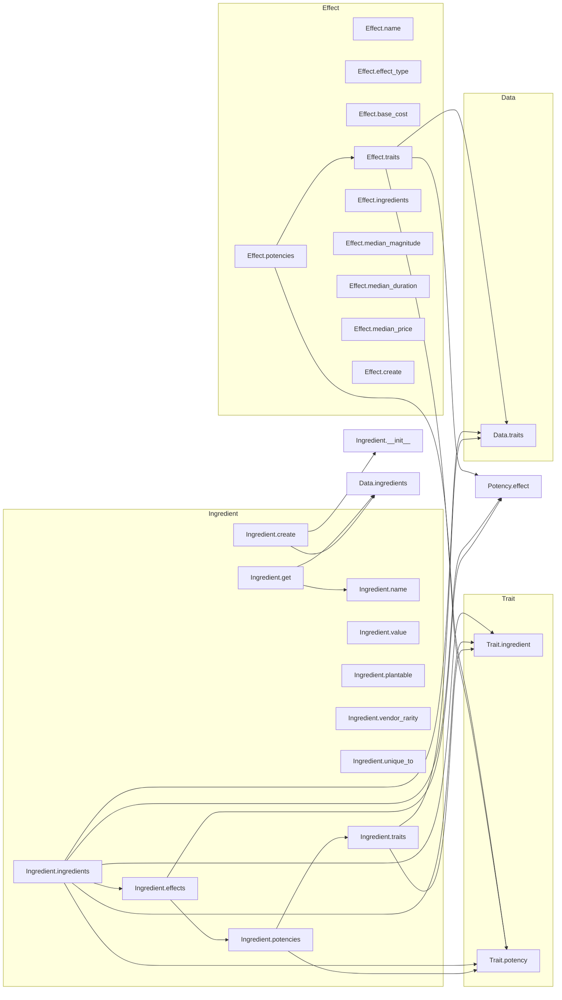

```mermaid
graph LR
subgraph Ingredient
    Ingredient.name
    Ingredient.value
    Ingredient.plantable
    Ingredient.vendor_rarity
    Ingredient.unique_to
    Ingredient.traits
    Ingredient.potencies
    Ingredient.effects
    Ingredient.ingredients
    Ingredient.create
    Ingredient.get
end

subgraph Effect
    Effect.name
    Effect.effect_type
    Effect.base_cost
    Effect.traits
    Effect.potencies
    Effect.ingredients
    Effect.median_magnitude
    Effect.median_duration
    Effect.median_price
    Effect.create
end


subgraph Trait
    Trait.ingredient
    Trait.potency
end

subgraph Data
    Data.traits
end
Ingredient.traits --> Data.traits & Trait.ingredient
Ingredient.potencies --> Ingredient.traits & Trait.potency
Ingredient.effects --> Potency.effect & Ingredient.potencies
Ingredient.ingredients --> Trait.ingredient & Data.traits & Trait.potency & Potency.effect & Ingredient.effects & Trait.ingredient
Ingredient.create --> Ingredient.__init__ & Data.ingredients
Ingredient.get --> Data.ingredients & Ingredient.name

Effect.traits --> Data.traits & Trait.potency & Potency.effect
Effect.potencies --> Effect.traits & Trait.potency


```